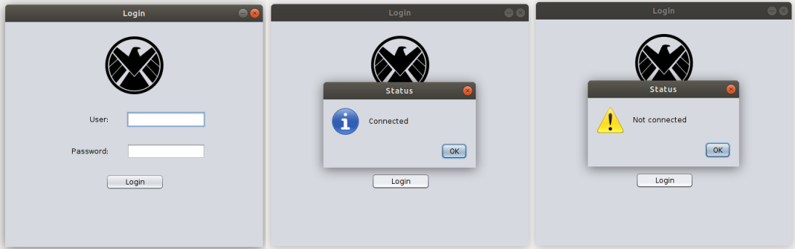
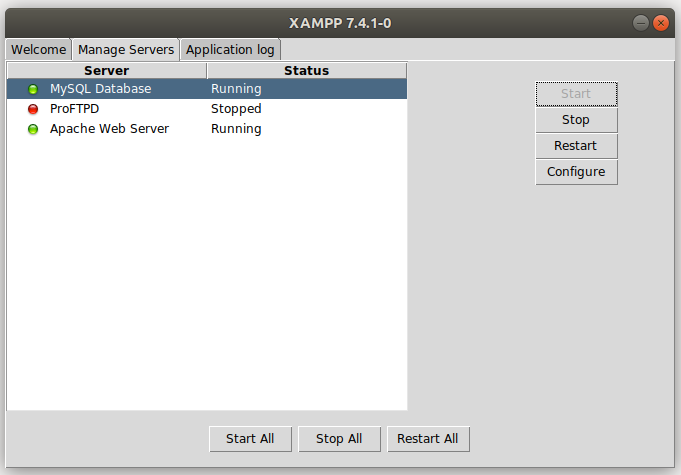
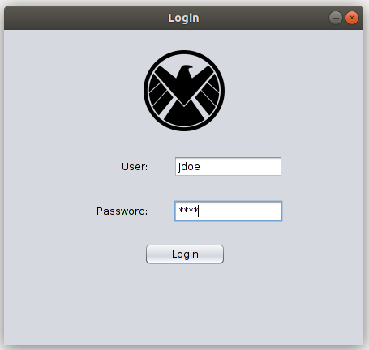

# Simple Login App With Java and MySQL

A Java MySQL app which pops up of a small login window. This window connects to a local mysql database to see if the login can be concluded or not.

# About this Project

This project's goal is to create a simple login app on which the user can enter the *username* and *password* and click login buttom. If *username* and *password* are in the database, then a message dialog will pop up and yell the success; else, another message dialog will pop yelling the failure.

# Getting Started

**Prerequisites**

To run this project, you'll need to have a basic environment to run a Java, MySQL App.

**Installing**

Cloning the Repository

    $ git clone https://github.com/awcasella/Simple-Login-Java-MySQL.git

    $ cd Simple-Login-Java-MySQL
  
Installation of XAMPP for MySQL and Java

- XAMPP installation tutorial can be found in [here](https://www.edivaldobrito.com.br/como-instalar-o-xampp-no-linux/).

- ORACLE Java installation tutorial can be found [here](https://www.edivaldobrito.com.br/oracle-java-no-ubuntu-18-04-lts/).

Run project
Open XAMPP and start MySQL Database and Apache Web Server. 

  

After that, open the terminal and start MySQL

    $ mysql -u root -p

Configure local database to be connected by our app:

    > create database if not exists login;
    
    > create table if not exists login(
    username VARCHAR(15) PRIMARY KEY,
    password VARCHAR(15) NOT NULL,
    email VARCHAR(25) NOT NULL,
    fname VARCHAR(15) NOT NULL,
    lname VARCHAR(15) NOT NULL,
    );
    
    > insert into login values ('jdoe', '2020', 'jdoe@domain.com', 'John', 'Doe');

**Note:** It is imperative to create a table named 'login' with the columns named 'username, password, email, fname, lname'. Otherwise, either the program will throw an exception or you'll have to change the code lines to make it compatible with the database.

Open NetBeans (or other IDE) and run the project. Make sure the file MySQLTest.java is the main file of the project.

# Built With
- [NetBeans](https://netbeans.org): Fits the pieces together.

- [MySQL](https://www.mysql.com): The world's most popular open source database.

- [XAMPP](https://www.apachefriends.org/pt_br/index.html): Installers and Downloaders for Apache Friends.

# References
- Interfaces gráficas com Swing. Caelum. Available at: [https://www.caelum.com.br/apostila-java-testes-xml-design-patterns/interfaces-graficas-com-swing/](https://www.caelum.com.br/apostila-java-testes-xml-design-patterns/interfaces-graficas-com-swing/). Access on January, 2020.
 
- Java Swing: Conheça os componentes JTextField e JFormattedTextField. DevMedia. Available at: [https://www.devmedia.com.br/java-swing-conheca-os-componentes-jtextfield-e-jformattedtextfield/30981](https://www.devmedia.com.br/java-swing-conheca-os-componentes-jtextfield-e-jformattedtextfield/30981). Access on January, 2020.
